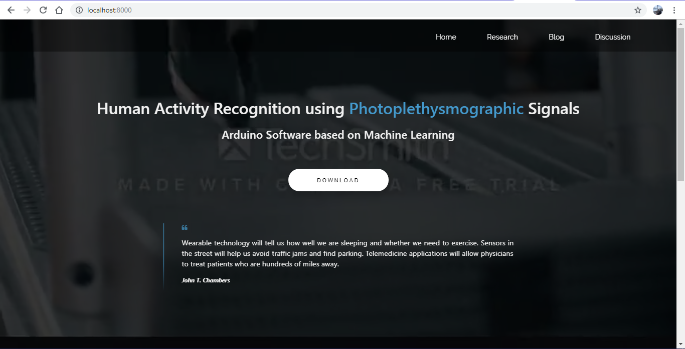
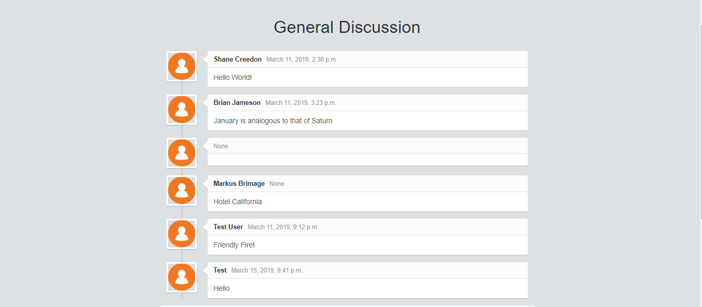
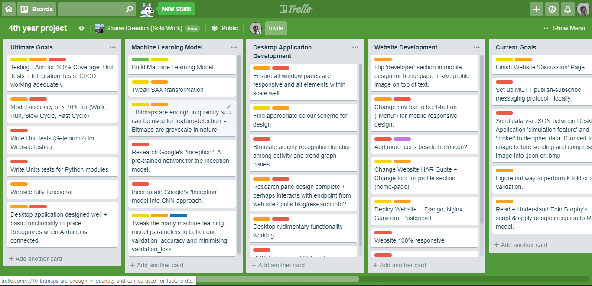
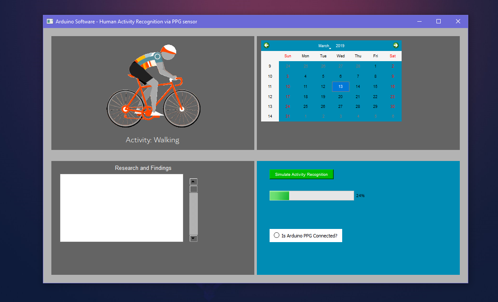
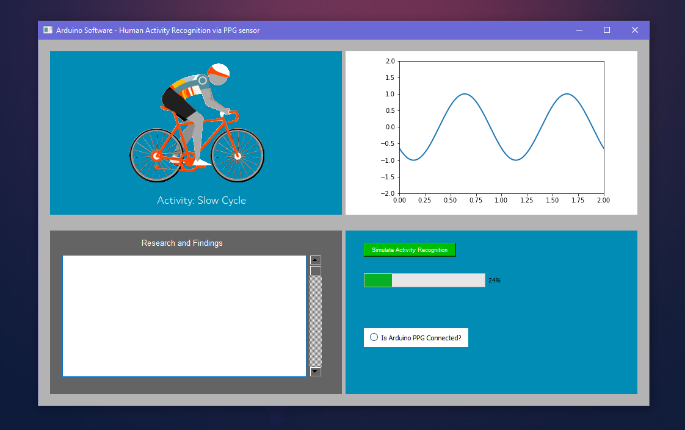
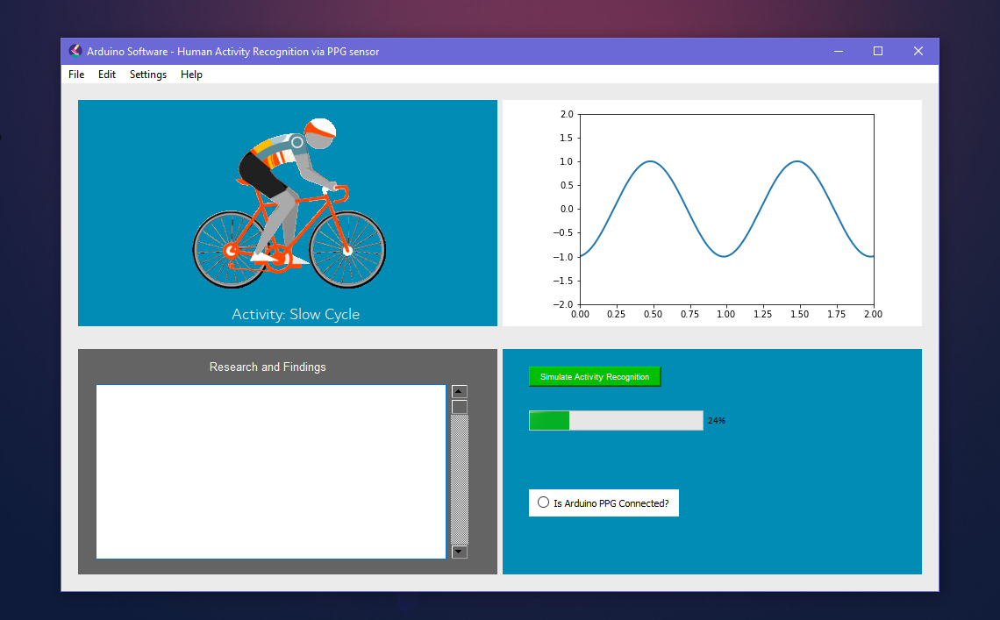
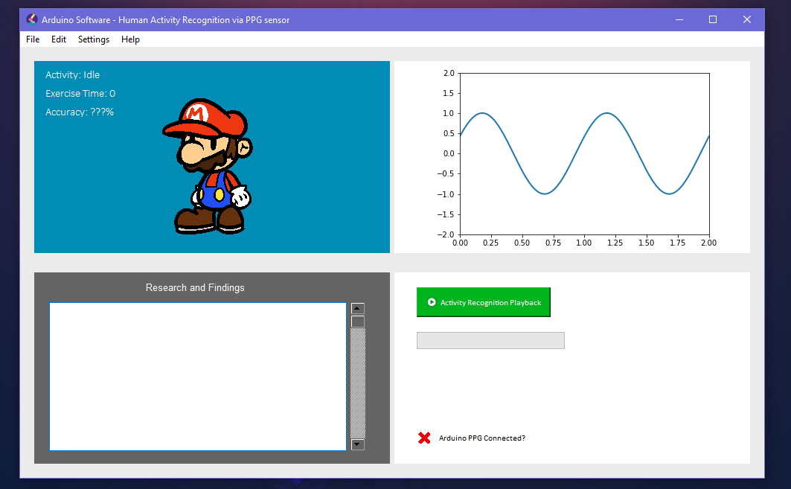
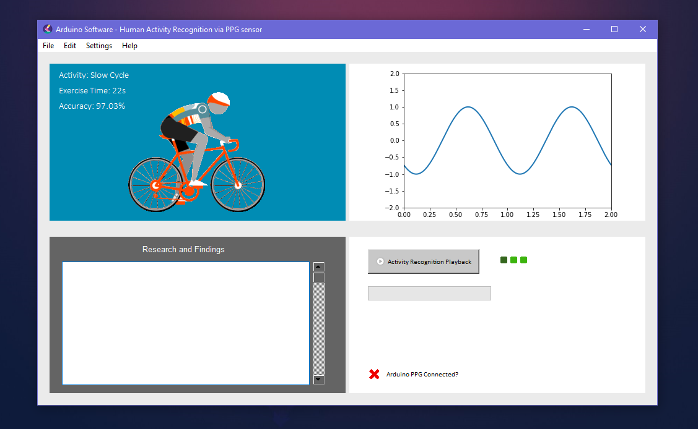

# Blog: Describing the engineering process of my 4th year project for DCU.
## The project involves recognising human activity using SAX and machine learning techniques.

**Shane Creedon**  
**Student ID: 15337356**  
**4th year Computer Applications and Software Engineering student in DCU**  

## Blog Post #1 | Proposal Submission and Upcoming Goals | 04/11/2018

The basis for the project is recognising human activity using wearable sensor technology based on 
Symbolic Aggregate Approximation (SAX) and Machine Vision.

After discussing the idea with Tomas in great detail, we both agreed to work together on this project as part of my 4th year project.
With the idea in mind, I constructed the proposal documented due for both Tomas and my presentation supervisors.
The proposal specified all the nitty-gritty details of the project and I hope gave clear insight into what we are trying to achieve.

I sent the document to Tomas for review and discussion the idea with the project presentation supervisors (Darragh & Mark)
who all thankfully approved the idea and allowed me to move forward.

My next primary goal is to set up Continuous Integration (CI) practices for my projects GitLab either using the GitLab
built-in CI tools or use something like Jenkins / Teamcity.

Week 9 requires the completion of my functional specification which needs to be ~25 pages in length describing the project
in great detail using both easy to understand language and UML diagrams depicting the technical structure.   

Currently it is week 7, I will aim to get these above two steps complete within the next week.

## Blog Post #2 | Development of the functional specification | 1/12/2018

Like most students, I have began working on my Function Specification discussing my project
idea in great detail. Within the specification, I discuss:
- An introduction section, where I overview the project and why we are building it.

- Section two provides a *General Description* of the product/system functions.
  It is in this section I detail a high-level abstract look at the individual functions our application will perform.
  I try my best to be as thorough as possible through the document while offering visualisations of the functionality for
  a stronger conceptual understanding.
  This section also discusses the many constraints my system will face throughout its development.

-  Section three will discuss all of the functions of the system in great, great detail.
   Each function will have a description, criticality overview, technical issues faced, 
   dependencies on other requirements and other details that many offer insight into the function.

- Section 4 looks at the system architecture and how the overall system will piece together.
  I offer visualisations here constructed on behalf of showing how system components tie with one another.

- Section 5 looks at the high-level design / abstract view of the system. 
  Within the section displayed are 3 Data-Flow Diagrams showing how data moves around individual components.
  There is also a minimalistic conceptual class diagram of how the application classes will interact.
  Finally, there is a use case diagram showing how a particular user may interact with the system.

- Section 6 shows the schedule of project activities over the course of the project timeline.
  I showcase a Gantt Chart diagram to display this information.

- Section 7 is a list of references I made use of when developing the project idea.

The blog is written in [markdown](https://github.com/adam-p/markdown-here/wiki/Markdown-Cheatsheet).
Markdown is a simple text-based mark-up language.

## Blog Post #3 | Week 12 - End of Semester One | 18/12/2018

Not much progress has been made on the project since I finished the functional specification back
in week 7/8. Other modules have taken up my time however, I have been doing some research on the topic
of Human Activity Recognition(HAR) and Machine Learning. In addition, i've looked into libraries
and possible design choices I could take when developing my application.

I came across and interesting article on how SAX (Symbolic Aggregate Approximation) can be implemented
within Java and I may use this to aid my development within Python. Google Scholar has been helpful for
finding Machine Learning related articles in the field. I have been looking a lot into **Supervised Learning**
research papers and methods to optimise convolutional neural networks for image classification.
Now, I will take some time off to spend with my family over christmas but once January hits, I will
be back in the books for the exams.

## Blog Post #4 | Examination Period | 06/1/2019

Happy new year to those reading and a happy christmas as well. I had been researching the project over the last
few days and coding some small prototypes to grasp how I was going to build the proclaimed software specified in the 
functional specification. With the DCU exams in several days time, I have decided to but the project on the back seat
while I focus thoroughly on my exams.

## Blog Post #5 | Beginning development of the project | 26/01/2019

Returning back from a week-long trip, I have started working on the project. I initially wanted to understand how
I was going to build a desktop application using Python. I looked into several different libraries which seemed to
offer the ability to do so. Eventually after enough research, I decided to go with PyQt5, which is based on QT. Qt is set of cross-platform C++ libraries that implement high-level APIs for accessing many aspects of modern desktop and mobile systems.

Additionally, I looked into how to convert a `.py` file into a `.exe` file for end-users which I managed to come across
a magical library for this exact purpose: **PyInstaller**. PyInstaller allows me to convert a .py file into a .exe file
along with a `.spec` configuration file for how the .exe file is run. 

## Blog Post #6 | Symbolic Aggregate Approximation | 28/01/2019

The project directory structure has been created. I have created a small template website which is intended
to host the download link for the application. In addition, the SAX python file (symbolic_aggregate_approximation.py)
was created and coded up to convert the PPG exercise data sets into a string of characters.

For example:
`cccccaabbcbcabbddddbbabdbebebeeeebdabdbdbaa`

The string above is just a simple example, the real string would be FAR FAR longer, representative of an hour in time.
We have long strings like this for all 4 activities: *Walk/Run/Low Resistance Bike/High Resistance Bike*

## Blog Post #7 | Bitmap Generation | 29/01/2019

With the ability to generate SAX strings from the PPG data sets, the next step was to convert these strings into images.
To do this, I found a library online called: `text-to-image`. This library allowed me to convert a subsequence of letters
from the SAX string into a grey-scale pixel-based image. Specifically, the images are 32 pixels in size and after generating
all the images for each SAX string for each activity, the **total number of available training images is greater than 10,000**.

This grey-scale image approach may not be the optimal approach for this problem and for convolutional neural network training but,
I will address this with my supervisor and I will research online and find out whatever the best approach is for image classification
in relation to the technique of Symbolic Aggregate Approximation(SAX).

## Blog Post #8 | Meetings and Discoveries | 16/02/2019

Myself and Tomas (Supervisor) have met up several times to discuss the project conceptually. He has given me great advice and
pushed me in the right general direction with the project. I read over **Eoin Brophy's** research paper on human activity recognition
in relation to PPGs and that also helped improve my abstract view of the project. Previously, I was aiming for 32 pixels within a bitmap
image for training, testing and validation. However, this only accumulated to 0.125 milliseconds of examination. As a result of reading Eoin's paper
and discussing with Tomas, I modified this approach to now take on 2 entire seconds of detail per image. This amounts to 512 pixels per image.  

Due to such a high pixel count per image, we decided to invoke the powers of **Transfer Learning** to ultimately improve our model's accuracy, by
using pre-existing models to save us much training time and improve our accuracy. This technique involves training the penultimate layer of the
convolutional neural network with our training data, and training the rest of the model with the transfer learning concept.  

Finally, Tomas suggested I do away with the saxpy library I was using as well as the text-to-image library I was using. We decided for the sake
of research and ad hoc project requirements that I would enter into the process of building my own SAX toolkit (library) and string to image conversion
process.

## Blog Post #9 | Normalisation problem discovery | 16/02/2019

Through a thorough analysis of the data, I noticed the normalisation process was modifying the data negatively. After normalisation, each SAX string would generate but the distances
between letters would be dictated solely on the data set the PPG microvolt data came from. What we really want is this to be relative to the entire project training data body.  
**For Example:** The walk data set would map q -> ~1600 mV while the high-resistance cycle data set would map q -> 1300.  

This is a problem and to address it I intend to make the comparison mapping values static to the project as a whole and not to the individual data set. The amplitude of our signals are discriminative, so therefore it might be best not to normalise.

## Blog Post #10 | SAX implementation & Bitmap Detail for Machine Learning | 17/02/2019

I have now wrote my own SAX module and bitmap generation scheme. Among the SAX module I wrote, I now have a very strong understanding of all the
underlying components that make it up. I also made the module flexible and simple to use and tweak settings. One can specify the range of letters
that make up the sax conversion process in addition to the lower-bounding property that makes up the window size of a particular letter.  

To achieve this, I took X amount of entries the user desired for the window size | E.G. 10. I average out the values of these 10 entries by summing them
and dividing by the quantity of entries. It is this average value I use to determine what letter these 10 entries should belong to. This is a simple yet
effective method for segmenting groups of microvolt signals into a single letter. Adjusting this property may improve our accuracy & efficiency in the future
so hence why I incorporate the feature.  

Finally, I wrote my own bitmap module using techniques found online. I decided to map each letter to a particular RGB value:  
**'a': (200, 125, 50)**  
**'b': (20, 200, 50)**  
**'c': (100, 90, 20)**  

Previously, I used the **text-to-image** library to convert my sax-ified textual string into grey-scale images, however for the sake of my understanding
and to improve the accuracy of our model, I looked into converting the images into RGB 24-bit based images. Using the library for grey-scale images also
resulted in strange image dimensions. The size of the generated image seemed unpredictable and for our model it is practically a requirement to have a
standardized image dimension. With writing my own bitmap module, I ensured that image sizes could only be 16x16 making up 256 pixels.  

> Example of old grey-scale images against new 24-bit rgb images

**8-bit Grey-scale bitmap**  
  

**24-bit RGB bitmap**  

# Blog Post #11 | Further Optional Parameters | 22/02/2019

To provide further optionality and further diversity among my machine learning solution, I enabled the ability for both RGB (24-bit) images and Greyscale (8-bit) images to be generated. I wrote two python scripts which allow the pixels to be mapped within an RGB octet range
and to be mapped within a Greyscale octet range.  

#### Why did I do this?
I did this to profilerate the amount of parameters we can adjust when building the project and tweaking the machine learning model.
With more parameters, the flexibility of the model rises. Through tweaking these parameters we can hopefully accentuate the validation accuracy of the model while reducing the validation loss.

# Blog Post #12 | The Convolutional Neural Network via TensorFlow and Keras | 30/02/2019

Deciding to jump right into the deep learning was the next move on the project agenda. I took a few hours to research several
python libraries and frameworks relating to machine learning like TensorFlow or Keras, Sci-Py was another one I researched.
Eventually I decided to embark on this data science journey using TensorFlow with Keras to construct a convolutional neural network.

I wrote about 200 lines of python code which constructed a machine learning model, which has 15 iterations (Epochs).  
I intend to use `TensorBoard` to monitor the model and ensure overfitting and underfitting are avoided.  
The model once trained is tested against a test set of images which are randomly obtained through the population.  
I believe the model encompasses a 80%/20% split in terms of training and testing data respectively.  

The training and testing set of images are converted to pickle files and are then shuffled to ensure the order is random.  
This is important to ensure the model does not overtrain on one particular characteristic and has an fair chance of getting any  
of the 4 labelled classes.  

The model itself is then saved as a .h5 file using `h5.py` and then subsequently, as .json files for easy access and easy loading/reading.  
These files take up a lot of space so they are generally hidden via `.gitignore`.

##### Model Accuracy and Model Performance

**Fig 1.0 - Early Stage Model - Accuracy: 51% - Tweaking at a minimum of model parameters**
.PNG)  

At this point, the model has not been tuned at all, it simply has been trained using our training images and tested via the test set.
Some of the details of the network configuration:
- The optimizer used is the `adam` optimizer,
- The lost function used is `Sparse Categorical Crossentropy`
- Activation function used is: `ReLU`

**Fig 1.1 - Best Model Accuracy Achieved: 74% - Tweaked - 25 Epochs, 12,000 images**
.PNG)  

Some of the details of the network configuration:
- The optimizer used is the `adam` optimizer,
- The lost function used is `Sparse Categorical Crossentropy`
- Activation function used is: `Sigmoid`

**Fig 1.2 - Cross Validation (More Realistic) Model - Accuracy: 62% - 5 Epochs - 28,000 images**
  

Neural network configuration details are the same as the 'Best Model' described above. However, the test set used has become
more realistic. Rather than taking 20% of the each class of image and using that as a test set, we have decided to take an entire
subject's data for Walk, Run, Slow Resistance Cycle and High Resistance Cycle. 

#### Why did we do this?

We felt the individual characteristics that each person has when it comes to human movement must be considered when testing our
model to get an accurate view. In the ultimatum of this projects life-cycle, the model must be capable of individual differences that  
would generally be associated with each unique person.

# Blog Post #13 | Website Development - Home Page | 04/03/2019

The website design uses a simple box model. It's primary goal is to simply host the download for the desktop application, however
I have decided to incorporate several different sections to understand the concept of the project as well as document any research
findings.

Website Tabular:
1. Home
2. Research
3. Blog
4. Discussion

The website uses the **Django Web Framework** for the back-end behaviour and **PostGresql** as the database technology.  
Additionally, **NginX** and **Gunicorn** are used for web server functionality with **LetsEncrypt** being used to supply the 
necessary SSL certificate to protect data and information on the website via encryption.

**Fig 2.0 - Top of Home Page**
  

A brief overview of the websites aims and what the software should achieve. Arduino based software with a mission to recognize 
human activity through machine learning.

---

**Fig 2.1 - Bottom of Home Page** 
.png)  

A bit about myself as well as a link to my websites and other online profiles/portfolios. Additionally, there is a link
to my Trello board which was set-up at a later date for following the projects progress.

# Blog Post #14 | Website Development - Discussion Page | 10/03/2019

Due to very many assignments DCU has placed on its final year students, project work had to take a back seat. Many of 
our modules demanded our attention and assignments were on-going constantly. I managed to make a small bit of progress with
the project by linking the discussion page up to the Postgres database and enabled the ability to create comments and see
other folks comments through the front-end UI.

**Fig 3.0 - Top of Discussion Page**
  

View other users comments about Human Activity Recognition

---

**Fig 3.1 - Bottom of Discussion Page**
.png)  

The ability to create your own comment and join the discussion.

# Blog Post #15 | Concurrent Trello Board |  11/03/2019

I set up a Trello Board to increase the connectivity and communication between myself and my supervisor. This allowed us to
share what activities I was prioritising and what steps needed to be taken to gradually move towards the end-goal. Additionally, 
the trello project board helped keep me focused on what task was to be ticked off next.  

**Fig 4.0 - Trello Project Board**
  

# Blog Post #16 | Desktop Application Design Process | 22/03/2019

With the Concurrent and Distributed Assignment out of the way as well as the Image Processing assignment, only 1 college assignment was remaining. Thus, my focus was beginning to return back to the fourth year project. I had initalised a basic desktop application GUI
several weeks back but it was very much in a bare-bones state. The previous iteration of the desktop application was about me understanding
how to build a desktop application using Python via: `PyQt5` and `PyInstaller`.  

`PyQt5` is a special python library for developing desktop applications. Originally based on C++, it was ported over to python enabling
more flexibility across programming languages.

`PyInstaller` is a python library which is capable of converting a python program to a .exe executable which will be extremely useful 
when allowing users to download the project from the online platform: https://www.projectactivityrecognition.ml/

**Fig 5.0 - Desktop Application Initial Iteration**
  

The initial iteration of the application is somewhat bland, but the idea is there.

**Fig 5.1 - Desktop Application Second Iteration**
  

The next iteration removed the placeholder calender object in the 2nd window-pane and modified some design aspects.

**Fig 5.2 -Desktop Application Third Iteration**
  

This iteration added the menu bar common in many desktop applications. Additionally the `Simulate Activity Recognition` button
found in the 4th window-pane works correctly. Once selected, the file explorer will be brought up on Windows or Linux allowing you
to select a .csv file for upload. This .csv file must contain a `Timestamp` column and a `Microvolt` column for accurate ppg real-
time playback. Once uploaded, sections of the data will be converted to an image and these images can be passed into our model for
predictions on which class label they belong to (Walk, Run, Low Resistance Cycle, High Resistance Cycle).

# Blog Post #17 | MQTT & Mosquitto - Subscribe/Publish Design Pattern | 25/03/2019
After speaking with my supervisor at our most recent meeting, we decided to place a large emphasis on the transfer learning portion of
the project. This will be done using **Google's Inception** https://medium.com/@williamkoehrsen/object-recognition-with-googles-convolutional-neural-networks-2fe65657ff90().  

Additionally, as per standard practice, I was advised to do K-fold cross validation. This involves repeatedly training the model on the different test data, picking a different test subject every time, and ultimately averaging out the 10 test cases. I was also tasked with doing up a Confusion Matrix for CNN results analysis.

In regards to how the `Simulate Activity Recognition` functionality was, at least from the previous blog post, supposed to work, the architecture has been modified somewhat. The intention now, through discussing with Tomas, is to use the MQTT (Message Queueing Telemetry Transport) protocol to asynchronously perform this function.

**How will this be done?**

There is a good diagram I created using Balsamiq below which gives a good overview of how all the components connect together. Regardless, 
I will describe how it works in text. The previous blog posts suggests that images will be generated from the data submitted and then simply
passed to the machine learning model for a predictive result. However this will no longer be the case. These generated images from the uploaded data will be subsequently compressed. The compressed images will not hinder the machine learning model's prediction as the images are only made up of 64x64 pixels of colours. It is advantageous to use compressed images due to speeding up latency and network performance. The compressed images will then be converted to an array of bytes and can then be sent along the network.  

All of the client machines that download the application will be able to click the particular button and upload a .csv file of the data.
These client machines that start the application will automatically subscribe to a `Open source MQTT broker` which I built using `Mosquitto`. These client machines will also publish data to the broker, that data being the compressed set of images representing the data they uploaded.
Once uploaded, this set of compressed images will pass to the broker at a particular topic, perhaps for example: `data_passageway_topic`.  

Another machine on the other side of the network will be subscribed to this topic and will receive the data bytes representative of the image.
This machine is where the processing will be done, and where the convolutional neural network will be based. It is here that the prediction 
result will be generated. Once generated, the result will be based back to the client machine and can be coordinated with the software to
showcase what activity was being performed at that time.

This is extremely advantageous as the program can still continue to perform other processes while asynchronously, the simulated activity is
being carried out.  

**Fig 6.0 - MQTT protocol (Publish / Subscribe)**
  

# Blog Post #18 | Machine Learning Model Progress (100x100) | 30/03/2019
The machine learning model finally gave a satisfactory accuracy evaluation but it was done using image sizes of 100x100 with a shift period of 16 pixels.
Walk, Run and Low resistance Bike gave a healthy accuracy evaluation and prediction was roughly 80% accurate on new training data. However, with High 
Resistance Bike, the model often associated it with Low Resistance Bike or Running. We believe this is due to the lack of data compared to the other classes.
A conceptual diagram has been posted below to showcase the data variations.

If this problem cannot be solved come the project ultimatum, we may simply just strip High Resistance Bike out of the individual classes,
leaving us with **Walk, Run and Low Resistance Bike**.

# Blog Post #19 | MQTT & Mosquitto - Subscribe/Publish Design Pattern | 05/04/2019
The publish-Subscribe model suggested by my Supervisor has been incorporated into the project. This model is based off
MQTT (Message-Queuing-Telemetry-Transport) which I have mentioned in a previous blog post - More Details on MQTT can be found
here: https://pypi.org/project/paho-mqtt/ or here: http://mqtt.org/.  

The model is as described above but I will place the concept diagram again here for those interested:
  

The Server is always in a looping state and always listening to the broker for requests on particular topics.
When a client joins, the instantly connects to the broker and subscribe to particular topics, for example:  
###### Topic: prediction_receieve
Additionally, the client also publishes to a topic that the server must subscribe and listen to. When the client activates the **Playback Activity Recognition**
or **Simulate Activity Recongition** feature, where by they submit a CSV file of PPG signals and the feature can decoded what activity they were performing at that
given time, the client will post to the server a **Base64** encoded string of SAX (Symbolic Aggregate Approximation) characters.  

##### Why do we send only the SAX encoded string using Base64?
My consideration of this idea led me to building a thin-client / fat-server architecture. The client side is only required to convert the uploaded CSV file of
PPG signals into a semantic string of symbolic characters. These string representations shows the heart-rate signals which have noise in them. It is from this noise
we can learn about what activity a person is doing. So, once the string is generated, we encode it using base64 and publish it over the network to our broker (Mosquitto Broker).
The broker then propagates this message to any clients that are subscribed to that particular topic | IE Our processing server.  

Once the server obtains the message contained the SAX string, we decode it and now have access to the characters representing the time-series data! 

# Blog Post #20 | Human Activity Recognition PPG signal Playback Feature | 07/04/2019
In the previous blog post, I mentioned we now were able to process the data on a separate server using MQTT. Well, after a few days of brainstorming and
solving problems and sub-problems, the **Activity Recognition Playback** feature has now been incorporated into the project. 

##### How does it work?
A client machine is capable of submitting a CSV file of PPG signals, normally recorded in micro-volts(mV). We convert this CSV file into a string
of characters representing the heart-rate signals, minus the inertial sensor of course. This string is encoded using base64 and sent to the processing
server via MQTT. The server reads the data and selects a substring of the data, and performs **batch processing** on the data such that the client does 
not have to wait a very long time for the playback feature to become apparent. Without this batch processing style for the feature, the user would be 
waiting for the entire csv to be converted to a set of bitmap images, and then for each image to be fed into the machine learning model (Convolutional Neural Network)
before publishing back to the client. This has a strong dependency on the size of the csv file they upload so it would be O(N) in some kind of time-complexity.
But I removed this O(N) time-complexity and modified it to be constant time, such that only 20 images are decoded at a time and fed into the network.  

The result of the images | IE the prediction that the model determines is published back to the relevant client. The server does this by having a mapping (Python Dictionary)
from each client object to each client ID that connected. The desktop application which acts as the client is entirely asynchronous in relation to the publishing 
mechanism going on in the background.  

To facilitate this back-end functionality that I implemented, I incorporated more front-end elements into the desktop application. For example:
1. Inclusion of Activity Animations representing the 4 Activities and an Animation for an 'idle' state.
2. I have added playback details by-way-of text in the relevant window pane inside the desktop application.
    - Activity Details which tell what a person is doing (Walk/Run/Low Resistance Bike/High Resistance Bike)
3. Animations were refactored using image editing tools to correctly fit the window of the application. 

# Blog Post #21 | Desktop Application Update v4.0 | 09/04/2019
Recent changes among the desktop application design include modifying the **Activity Recognition Playback** functionality to be green in colour with the
ability to 'disable' once the playback function is happening. We don't want more than one playback to be happening or we could overload the server.
Each time the server receives an activity playback request, it spins up a new thread to facilitate that client on. The design of the button also now
includes an icon for an enhanced look.

I have also added a red cross icon animation alongside some text which tells the user if their PPG device is successfully connected.
Additionally, there is a loading animation that spawns once the activity recognition playback feature is invoked.

Diagram of the initial application state:

Diagram of the application during playback state:

##### As you can see, the playback button has changed colour to a light-grey, indicating that the activity playback feature is underway.
##### There also is the loading animation, displayed by the 3 green-dots, which alternate in colour, providing a 'loading' impression.
##### Also, as you can see the activity animation has changed, as well sa the details associated with that activity.

# Blog Post #22 | Machine Learning Model Update (32 x 32) | 25/03/2019
With recent adaptions to the project, I've modified the image size to be be 32x32 that is up-scaled to be 128x128. The reason for this change
was that, previously with the 100x100 image approach, 100x100 is enough characters to determine 40-seconds of the data file uploaded.
This is not what we want, we want to be able to determine what activity is being performed after only several seconds of interpretation.
With 32x32, we can try predict what activity is being performed using only 4-seconds of data. If possible, we can also look at 2-seconds of data
for optimal behaviour, but I doubt we will achieve this. 

# Blog Post #23 | Obtaining the PPG-enabled Arduino   | 11/04/2019
The arduino kit and PPG device alongside a pre-amp have been obtained. Through interacting and communication with members from DCU's Insight Centre,
I now have the device in question that can perform heart-rate determination using optical signals. The next steps are to incorporate it into the application
and have the application recognise when a PPG has been connected. My current thinking is that we will have two states for the application, one where
the application is in an 'idle' mode where the playback functionality can be accessed and other information can be viewed and another state, namely the
'Real Time Activity Recognition state', where by the connected ppg device's data will be sent to our MQTT broker and subsequently server, and eventually back to
the client, to determine there activity. When we say 'Real Time activity recognition', we really mean 'Quasi' real time activity recognition, as we will require
a certain number of seconds to determine their activity | IE 2, 4 or maybe even 8 seconds of data before activity determination.